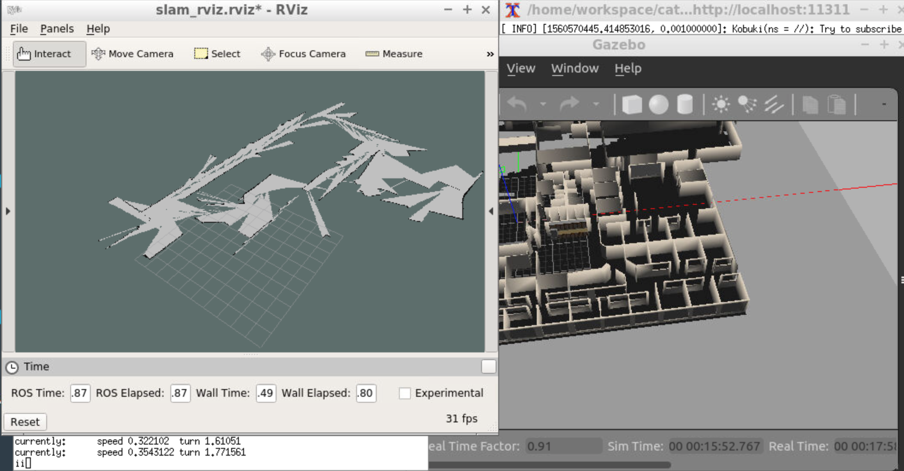

# SLAM Lab
Implementation of a gmapping ROS package which is based on the Grid-based FastSLAM algorithm to map an environment. This is a modified version of Udacity's [RoboND SLAMLab solution ](https://github.com/udacity/RoboND-SLAMLAb), mainly for my reference and experiments.

### Prerequisites
Since I have not tested on multiple platforms, and versions, I am listing only the configuration I used

* Ubuntu 16.04 OS with default make (>=4.1) and g++/gcc (>=5.4) packages
* Gazebo >= 7.0
* ROS Kinetic


### Steps to launch the simulation

#### Step 1 Create a catkin workspace
Skipt this step if you already have a workspace

```sh
$ mkdir -p /home/workspace/catkin_ws/src
$ cd catkin_ws/src/
$ catkin_init_workspace
$ cd ..
$ catkin_make
```

#### Step 2 Clone the package in src
```sh
$ cd /home/workspace/catkin_ws/src
$ git clone https://github.com/viks8dm/SLAM_Lab.git
```

#### Step 3 Clone supporting packages in src
```sh
$ git clone https://github.com/turtlebot/turtlebot_simulator
$ git clone https://github.com/turtlebot/turtlebot
```

#### Step 4 Install package dependencies
```sh
$ cd ..
$ source devel/setup.bash
$ rosdep -i install turtlebot_gazebo
$ rosdep -i install turtlebot_teleop
```

#### Step 5 Build, source workspace & launch nodes
```sh
$ catkin_make
$ source devel/setup.bash
$ ./slam.sh
```
This will launch Gazebo and Rviz. Rviz will load previously saved configuration.

### Sample Result
In the terminal, use the keyboard commands(u-i-o-j-k-l-m-,-.) and drive the robot around. You'll see a map of the environment in Rviz Similar to that shown below:



